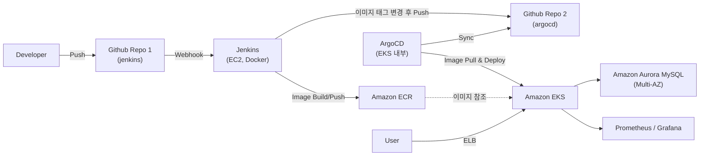

# [한국휴렛팩커드] 하이브리드 클라우드 아카데미 1기 최종 프로젝트 — Plumbers

> 국비지원 클라우드 아카데미(하이브리드 클라우드 아카데미 1기) 팀 프로젝트로 2024.04.19 ~ 2024.06.07 기간 동안 진행했습니다. AWS EKS 환경에서 Jenkins + ArgoCD 기반 CI/CD 파이프라인을 직접 구축한 프로젝트입니다.
>
> 원본 저장소: [multicampus-plumber/jenkins](https://github.com/multicampus-plumber/jenkins) (팀 조직 저장소를 fork)

**IT 구직자들을 위한 자기소개서/면접후기 공유 웹사이트**를 AWS 클라우드 위에 컨테이너 기반으로 배포하고, 코드 변경이 자동으로 반영되는 CI/CD 파이프라인과 트래픽 급증에 대응하는 오토스케일링·모니터링 체계를 구축했습니다.

## 팀 구성 및 담당

| 이름 | 역할 | 담당 업무 |
| --- | --- | --- |
| **전병준 (본인)** | 팀장 | 전체 프로젝트 구성 및 점검, **AWS 인프라(VPC/EKS/RDS) 구축**, **웹페이지(프론트/백엔드) 개발** |
| 김건우 | 팀원 | CI/CD 환경 구축, 웹페이지 개발 |
| 추윤식 | 팀원 | CI/CD 환경 구축, AWS 환경 구축 |

> 이 프로젝트에서는 AWS 인프라 설계·구축과 웹 애플리케이션 개발을 주도적으로 담당했습니다.

---

## 목차

1. [저장소 구성](#저장소-구성)
2. [인프라 아키텍처](#인프라-아키텍처)
3. [VPC / 네트워크 설계](#vpc--네트워크-설계)
4. [EKS 클러스터](#eks-클러스터)
5. [CI/CD 파이프라인](#cicd-파이프라인)
6. [데이터베이스 (RDS)](#데이터베이스-rds)
7. [모니터링](#모니터링)
8. [오토스케일링 (HPA)](#오토스케일링-hpa)
9. [기술 스택](#기술-스택)
10. [트러블슈팅](#트러블슈팅)
11. [프로젝트 일정](#프로젝트-일정)
12. [개선 방향 / 회고](#개선-방향--회고)
13. [보안 관련 안내](#보안-관련-안내)

---

## 저장소 구성

이 프로젝트는 CI/CD 파이프라인 특성상 **저장소가 2개로 분리**되어 있습니다.

| 저장소 | 역할 |
| --- | --- |
| **aws-eks-cicd-plumbers** (이 저장소, 원본 `jenkins` repo를 fork) | 애플리케이션 소스 코드(frontend/backend), Dockerfile, Jenkinsfile — Jenkins가 이미지를 빌드/푸시하는 대상 |
| **[argocd](https://github.com/multicampus-plumber/argocd)** (팀 조직 원본 저장소) | Kubernetes 배포 매니페스트(deployment/service/hpa) + Kustomize 설정 — ArgoCD가 이 저장소를 보고 EKS에 동기화 |

> 원래는 하나의 저장소로 CI/CD를 구성했으나, **이미지 태그 변경 커밋이 다시 빌드를 트리거하는 무한 루프 문제**가 발생해 저장소를 CI용/CD용으로 분리했습니다. (자세한 내용은 [트러블슈팅](#트러블슈팅) 참고)

---

## 인프라 아키텍처



- **프론트/백엔드**: React(정적 파일) + Node.js(Express)를 하나의 Docker 이미지로 빌드, Nginx가 정적 파일 서빙 및 `/api` 경로를 백엔드로 리버스 프록시.
- **CI**: Jenkins가 GitHub Webhook을 받아 Docker 이미지를 빌드하고 Amazon ECR에 푸시.
- **CD**: ArgoCD가 별도 매니페스트 저장소(`argocd` repo)를 Kustomize 기준으로 동기화하며, EKS에 자동 배포 (`syncPolicy.automated`로 Push 기반 GitOps 구성).
- **데이터베이스**: Amazon Aurora(MySQL 호환)를 Multi-AZ로 구성해 리더/라이터 인스턴스를 분리.
- **모니터링**: Prometheus + Grafana를 EKS 내부에 Helm으로 설치, LoadBalancer로 외부에서 접근.

---

## VPC / 네트워크 설계

CI(Jenkins)와 CD(EKS) 환경을 **VPC 단위로 분리**해서 구성했습니다.

| VPC | CIDR | 용도 |
| --- | --- | --- |
| `jenkins-vpc` | `10.0.0.0/16` | Jenkins EC2(Bastion 겸용) 전용 |
| `eks-vpc` | `20.0.0.0/16` | EKS 클러스터, Bastion, RDS |

**eks-vpc 서브넷 구성** (2개 가용영역 × Public/Private 이중화)

| Subnet | CIDR | 용도 |
| --- | --- | --- |
| eks-public-1a / 2c | 20.0.1.0/24, 20.0.2.0/24 | Bastion, NAT Gateway |
| eks-private-3a / 4c | 20.0.3.0/24, 20.0.4.0/24 | EKS Control Plane |
| eks-private-5a / 6c | 20.0.5.0/24, 20.0.6.0/24 | RDS (Multi-AZ) |

- Public 서브넷의 NAT Gateway를 통해 Private 서브넷의 아웃바운드 트래픽을 처리 (가용영역별로 NAT Gateway를 이중화해 단일 장애점을 줄임).
- Jenkins와 EKS를 별도 VPC로 분리해, **CI 환경 장애가 운영 클러스터 네트워크에 영향을 주지 않도록** 격리.

**보안 그룹 설계**

| 이름 | 포트 | 소스 |
| --- | --- | --- |
| `eks-bastion-sg` | 22 | Anywhere |
| `eks-cluster-sg` | ALL | ELB(monitor/application/jenkins), eks-cluster-sg |
| `eks-controlPlane-sg` | 443 | eks-worker-sg |
| `eks-worker-sg` | ALL / 1025-65535 / 443 | eks-worker-sg, eks-controlPlane-sg |
| `elb-application-sg` / `elb-jenkins-sg` / `elb-monitor-sg` | 80 | Anywhere |
| `rds-sg` | 3306 | Anywhere |
| `jenkins-bastion-sg` | 22, 443, 80, 8080 | Anywhere |

> 교육 목적상 일부 보안 그룹의 소스를 Anywhere로 열어두었는데, 실제 운영 환경이라면 대역을 좁히거나(NAT Gateway EIP, VPN 등) ALB/NLB 뒤로만 노출하는 방식으로 개선이 필요합니다. ([개선 방향](#개선-방향--회고) 참고)

---

## EKS 클러스터

| 항목 | 값 |
| --- | --- |
| Cluster Name | eks-cluster-project |
| Kubernetes Version | 1.27 |
| Control Plane 서브넷 | private-3a, private-4c (2-AZ) |
| Worker AMI | AL2_x86_64 |
| Worker Instance Type | t3.medium |
| Worker Node 수 | min 4 / desired 4 / max 10 (Auto Scaling Group) |

- Worker Node를 4대 상시 운영하며 Auto Scaling Group으로 최대 10대까지 확장 가능하게 설정.
- EKS 애드온으로 **Amazon EBS CSI Driver**를 설치해 Prometheus/Grafana의 PersistentVolume을 AWS EBS로 동적 프로비저닝(PVC).

---

## CI/CD 파이프라인

### 흐름

```
Developer → Github Repo 1(jenkins) → Webhook → Jenkins
  → Docker Image Build → ECR Push
  → Kustomize로 이미지 태그 변경 → Github Repo 2(argocd)에 Push
  → ArgoCD가 Repo 2 감지(Sync) → EKS에 자동 배포
```

### Jenkins 구성

- Jenkins는 별도 EC2 인스턴스에 **Docker로 직접 구축**하고, EIP를 할당해 8080 포트로 관리자가 접속.
- 추가 설치한 플러그인: `Docker`, `Docker Pipeline`, `Docker-build-step`, `AWS SDK: ECR`, `GitHub Integration Plugin`.
- 파이프라인 트리거는 **GitHub Webhook**(`GitHub hook trigger for GITScm polling`)으로 설정해, `jenkins` 저장소에 push가 발생하면 자동으로 빌드 시작.

### Jenkinsfile 파이프라인 단계 (실제 코드 기준)

1. **Checkout Application Git Branch**: `jenkins` 저장소의 `main` 브랜치 체크아웃
2. **Docker Image Build**: `docker build`로 이미지 빌드, 빌드 번호(`${currentBuild.number}`)와 `latest` 두 태그 생성
3. **Docker Image Push**: `withDockerRegistry`로 ECR 인증 후 두 태그 모두 push, 로컬 이미지는 성공/실패 관계없이 정리(`docker rmi`)
4. **Deploy**: `argocd` 저장소를 클론해 `kustomize edit set image`로 이미지 태그를 새 빌드 번호로 변경 후 커밋
5. **Push to Git Repository**: 변경된 매니페스트를 `argocd` 저장소의 `main` 브랜치에 push

각 단계는 `post { success / failure }` 블록으로 성공/실패를 로그로 남기도록 구성했습니다 (Slack 알림 연동 코드도 작성했으나 이번 프로젝트에서는 주석 처리 상태로 남겨둠).

### ArgoCD 구성

- ArgoCD는 EKS 내부 `argocd` 네임스페이스에 Helm/매니페스트로 설치, `LoadBalancer` 타입 Service로 외부에서 접근 가능하도록 구성.
- Application 매니페스트는 `argocd` 저장소를 `repoURL`로 지정하고 `syncPolicy.automated.prune/selfHeal: true`로 설정해, 저장소 변경 시 사람 개입 없이 자동 동기화 + 드리프트(수동 변경) 자동 복구되도록 함.
- 배포 대상 네임스페이스는 `myportfolio`이며, `kustomization.yaml`의 `namePrefix: prod-`로 리소스 이름에 `prod-` 접두사를 붙여 관리.

---

## 데이터베이스 (RDS)

| 항목 | 값 |
| --- | --- |
| Engine | Amazon Aurora (MySQL 5.7 호환), 버전 2.11.5 |
| Instance Class | db.t3.small |
| 가용성 | 다른 AZ에 리더 인스턴스(복제본) 생성 — Multi-AZ 구성 |
| VPC / Subnet | eks-vpc / eks-private-5a, eks-private-6c |
| 테이블 | `userTable`(회원 정보), `jaso`(자기소개서 게시글), `interview`(면접후기 게시글) — `username`으로 게시글과 회원을 연결 |

- 세션 저장소도 별도 Redis 없이 **MySQL 기반 세션 스토어**(`express-mysql-session`)로 구성해 RDS에 함께 저장.
- 비밀번호는 `bcrypt`로 해시하여 저장.

---

## 모니터링

- Helm으로 `prometheus-community`, `grafana` 차트를 EKS에 설치.
- Prometheus: PVC 100GB 할당, 데이터 보존 기간 15일(`retention: "15d"`)로 설정.
- Grafana: PVC 10GB 할당, `LoadBalancer` 타입으로 노출해 관리자가 별도 포트포워딩 없이 접근 가능.
- Grafana 대시보드에서 노드별 CPU/메모리 사용률, Pod/PVC 개수, 클러스터 정상 가동률(100%), API 서버 응답 등을 실시간으로 확인.

---

## 오토스케일링 (HPA)

```yaml
apiVersion: autoscaling/v1
kind: HorizontalPodAutoscaler
metadata:
  name: demo-autoscale
spec:
  scaleTargetRef:
    apiVersion: apps/v1
    kind: deployment
    name: prod-demo-nginx
  minReplicas: 1
  maxReplicas: 10
  targetCPUUtilizationPercentage: 50
```

- CPU 사용률이 50%를 넘으면 최대 10개까지 Pod를 자동 증설하도록 설정.
- Metrics Server를 설치해 kube API로 메트릭을 전달, HPA가 이를 감지해 워크로드를 자동 조정.
- `ab`(Apache Bench)로 부하 테스트를 진행해 트래픽 증가 시 Pod가 실제로 늘어나는지 검증.

---

## 기술 스택

| 분류 | 기술 |
| --- | --- |
| 클라우드 | AWS (VPC, EC2, EKS, ECR, RDS, ELB, EBS) |
| 컨테이너/오케스트레이션 | Docker, Amazon EKS (Kubernetes 1.27) |
| CI/CD | Jenkins, ArgoCD, Kustomize, GitHub |
| 백엔드 | Node.js, Express, express-session + express-mysql-session |
| 프론트엔드 | React, MUI |
| 웹서버 | Nginx (정적 파일 서빙 + `/api` 리버스 프록시), PM2 (Node 프로세스 관리) |
| 데이터베이스 | Amazon Aurora (MySQL 호환) |
| 모니터링 | Prometheus, Grafana |
| 오토스케일링 | Kubernetes HPA + Cluster Auto Scaling Group |

---

## 트러블슈팅

**1. CI/CD 무한 빌드 루프**
- **문제**: 저장소를 하나로 통합해 구성했을 때, Jenkins가 이미지 태그를 변경하고 같은 저장소에 커밋 → 그 커밋이 다시 Webhook을 트리거 → 다시 빌드가 도는 무한 루프 발생.
- **해결**: 애플리케이션 코드 저장소(jenkins)와 배포 매니페스트 저장소(argocd)를 분리. Jenkins는 배포 저장소에만 커밋하고, 애플리케이션 저장소의 Webhook과는 분리되어 루프가 끊어짐.

**2. HPA가 트래픽 부하에도 동작하지 않음**
- **문제**: `ab`로 부하 테스트를 했음에도 Pod 수가 늘어나지 않음.
- **원인**: CD 저장소의 `deployment.yaml`에서 `replicas` 값이 고정되어 있어 HPA가 개입할 수 없는 상태였음.
- **해결**: `deployment.yaml`에서 `replicas` 필드를 제거해 HPA가 레플리카 수를 제어하도록 수정.

**3. 비대면 협업의 어려움**
- 물리적 거리와 협업 경험 부족으로 초반 의사소통에 어려움을 겪음. 별도 음성 채널, 단체 대화방, 구글 드라이브 등을 활용해 지속적으로 소통하며 극복.

---

## 프로젝트 일정

| 구분 | 기간 | 수행 내용 |
| --- | --- | --- |
| 프로젝트 기획 | 04/19 ~ 04/26 | 주제 선정, 기획안 작성, 역할 분배 |
| AWS 환경 구축 | 04/29 ~ 05/03 | Jenkins/EKS용 Bastion 구축, RDS 환경 구축 |
| CI/CD 파이프라인 구축 | 05/06 ~ 05/10 | Jenkins, ArgoCD, GitHub 연동 |
| 홈페이지 환경 & 모니터링 구축 | 05/13 ~ 05/17 | Node/Nginx 웹 서버, React 구현, Prometheus/Grafana |
| 홈페이지 개발 | 05/20 ~ 05/31 | 회원가입/로그인, 게시글 CRUD, RDS 연결 |
| 최종 점검 | 06/02 ~ 06/06 | 문서화, 경진대회 준비 |

---

## 개선 방향 / 회고

프로젝트 당시 팀에서 정리한 개선사항과, 인프라 관점에서 스스로 짚어본 한계입니다.

- **IaC 미적용**: AWS 콘솔에서 직접 리소스를 구성해, 인프라 변경 이력 추적이나 동일 환경 재현이 어려웠습니다. Terraform/CloudFormation으로 코드화하면 재현성과 리뷰 가능성이 크게 개선될 것입니다.
- **보안 그룹이 과도하게 개방적**: 다수의 보안 그룹이 `Anywhere-IPv4`로 설정되어 있어, 실제 운영이라면 소스 대역 제한과 WAF 도입이 필요합니다.
- **네임스페이스/RBAC 세분화 부족**: 학습 목적상 클러스터 권한을 단순하게 운영했는데, IAM Role for Service Account(IRSA) 및 네임스페이스별 RBAC을 세분화하면 더 안전합니다.
- **소셜 로그인/파일 업로드 등 사용자 기능 미완성**: 시간상 기본 CRUD까지만 구현.
- 세 팀원 모두 "팀 프로젝트 협업 경험 부족", "개인 기술 역량 보완 필요"를 공통적으로 회고에 남겼습니다.

---

## 보안 관련 안내

레포지토리 코드(`backend/lib/db.js`, `backend/lib/sessionOption.js`)에 **RDS 접속 정보(호스트, 계정, 비밀번호)가 하드코딩**되어 있습니다. 이는 교육 과정 중 공용으로 사용하던 임시 AWS 계정 리소스이며 현재는 종료되어 유효하지 않은 값이지만, 포트폴리오로 코드를 공개하실 경우 아래를 권장드립니다.

- 실제 값은 환경 변수(`.env` + `.gitignore`)로 분리하고, README/코드에는 placeholder만 남기기
- 이미 공개 저장소에 커밋된 이력이 있다면, 커밋 히스토리에서 완전히 제거(BFG Repo-Cleaner 등)하거나 최소한 README에 "학습용 임시 계정으로 현재 유효하지 않음"을 명시
